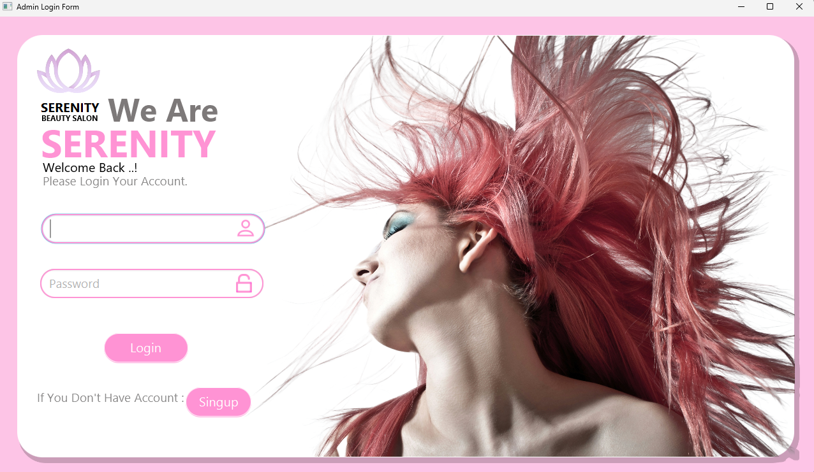
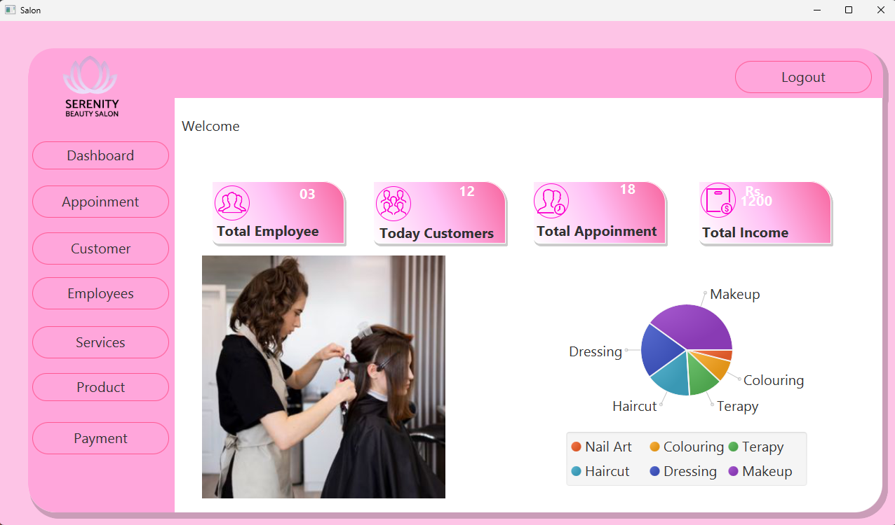
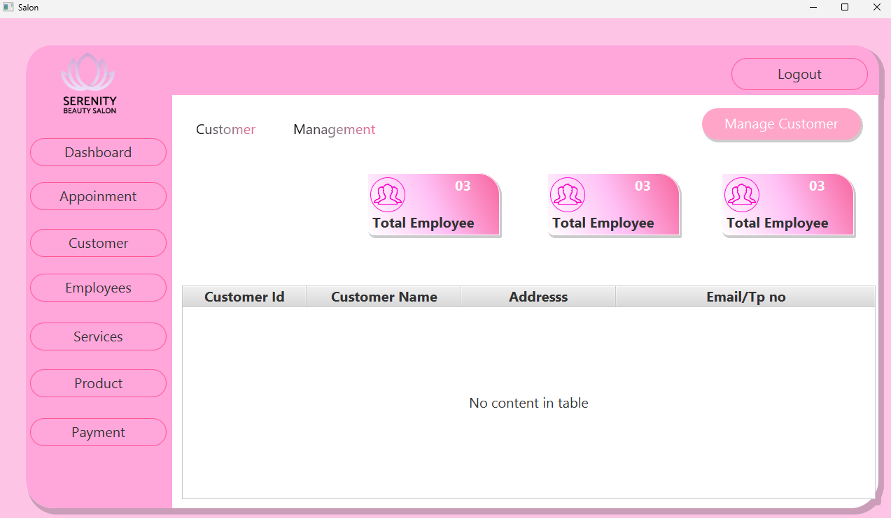
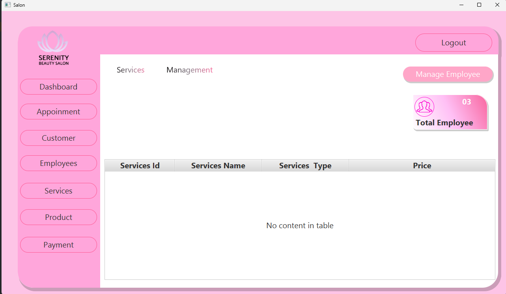
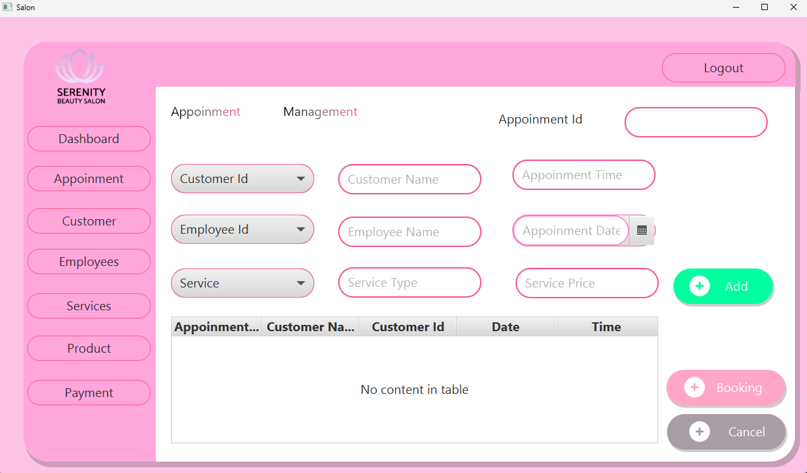
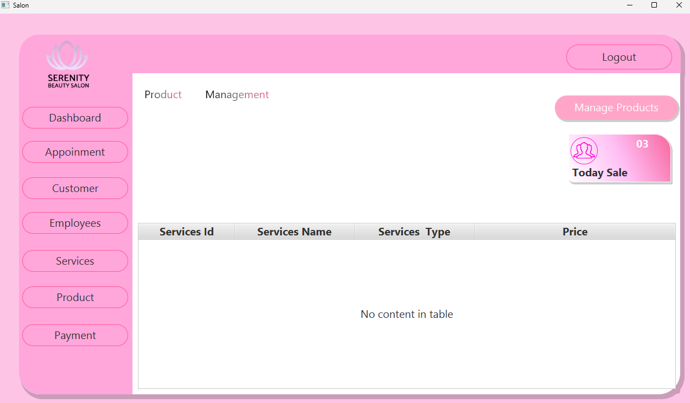

# Serenity Beauty Salon Management System

A desktop application for managing the operations of Serenity Beauty Salon, built with Java, JavaFX, and FXML. The system provides features for handling appointments, customers, employees, products, payments, and services.

## Features
- Admin login and authentication
- Customer management (add, update, delete, view)
- Employee management
- Appointment scheduling and management
- Product and inventory management
- Service management
- Payment processing
- Dashboard with analytics

## Technologies Used
- Java 8+
- JavaFX
- FXML
- Maven (for dependency management)

## Project Structure
```
src/main/java/lk/ijse/serenity/         # Java source code
src/main/resources/view/                 # FXML UI files
src/main/resources/style/                # CSS stylesheets
src/main/resources/assets/               # Images and videos
src/main/resources/sql/                  # SQL scripts
```

## Getting Started

### Prerequisites
- JDK 8 or higher
- Maven
- JavaFX SDK (if not bundled with your JDK)

### Running the Application
1. Clone the repository:
   ```
   git clone <repository-url>
   ```
2. Navigate to the project directory:
   ```
   cd salon-management-SERENITY-BEAUTY-SALON
   ```
3. Build the project with Maven:
   ```
   mvn clean install
   ```
4. Run the application:
   ```
   mvn javafx:run
   ```
   Or run the `Appinitializer` class from your IDE.

### Database Setup
- The SQL schema is located at `src/main/resources/sql/schema.sql`.
- Set up your database as required and update the database connection settings in the project if needed.

## Screenshots

Below are screenshots of the Serenity Beauty Salon Management System. All screenshots are located in:

```
src/main/resources/assets/images/screenshots/
```

### Login Form


### Dashboard


### Customer Management


### Employee Management


### Appointment Scheduling


### Product Management


## License
This project is for educational purposes.

## Author
- Dumindu Dilanjana

---
Feel free to contribute or suggest improvements!
